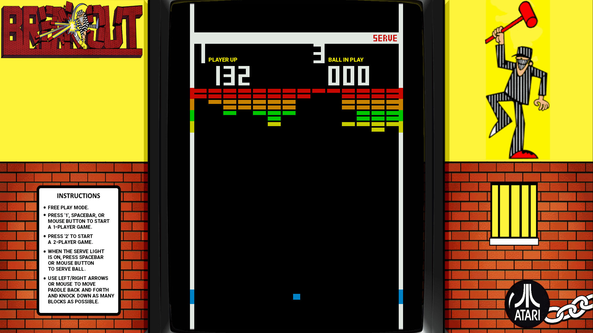
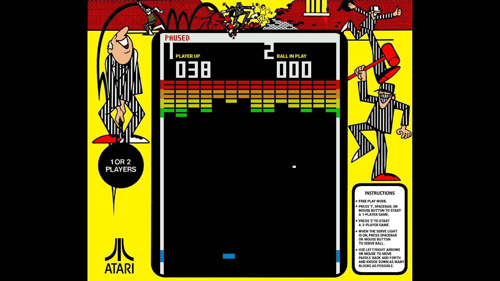
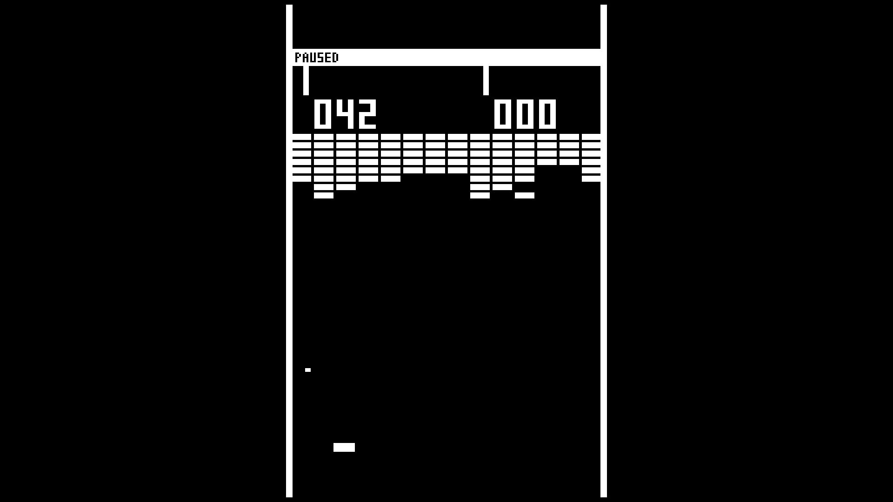
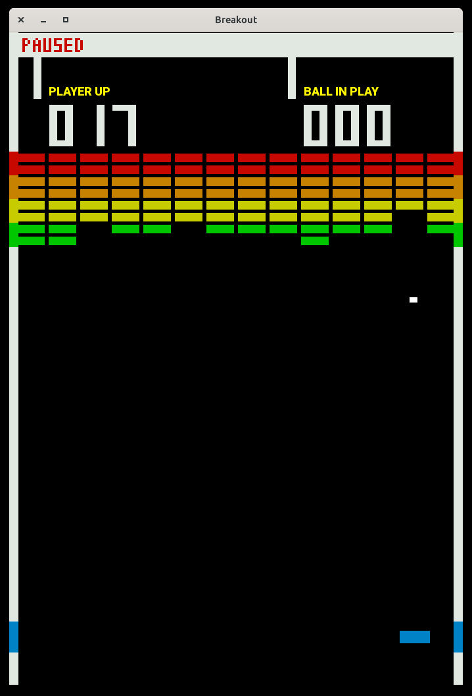
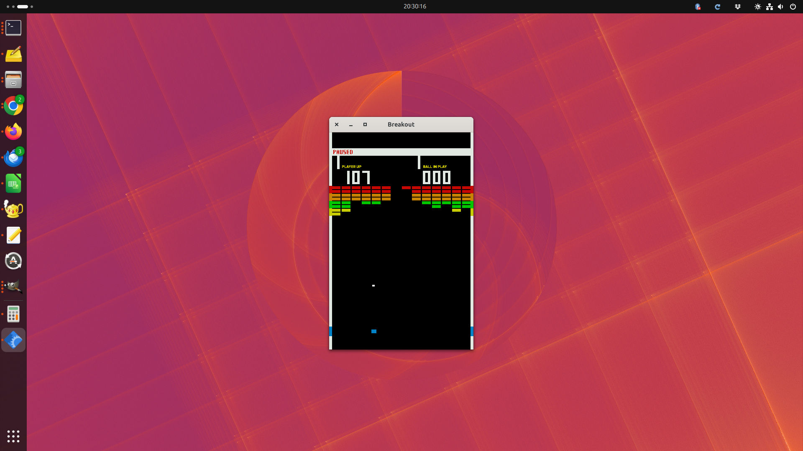

# Breakout-Pi (Breakout 1976 RetroPie Edition)

[](https://www.python.org)
[](http://www.pygame.org/news.html)
[](LICENSE)


## About

This project is a hardware-faithful Python and Pygame recreation of the original 1976 Atari **Breakout** arcade game. 

It was developed specifically with **RetroPie** and the **Raspberry Pi 4** in mind. Since the Raspberry Pi 4 cannot emulate the original game's complex Transistor-Transistor Logic (TTL) circuits via traditional emulators like MAME, this Python implementation serves as a lightweight alternative to bring the authentic arcade experience to the system. While optimized for RetroPie, it can easily be run on any standard desktop environment (Linux, macOS, Windows) either in a window or full-screen mode.

The game is designed to be highly faithful to its historic TTL predecessor, emulating original physics, brick layouts, and ball mechanics. However, a few modern enhancements and gameplay improvements have been introduced. For purists, these enhancements can be disabled entirely using command-line options.

## Features & Controls

### Authentic Gameplay, Flexible Display

Faithfully replicates the original 1976 speed, angles, and score mechanics. Use full-screen or windowed modes (normal, mini) via CLI options.

### Controls
*   **1, spacebar, mouse button, or joystick button:** Start a 1-player game.
*   **2:** Start a 2-player game.
*   **Spacebar, mouse button, or joystick button:** Launch ball
*   **Mouse / Keyboard (Arrow Keys):** Move the paddle left or right.
*   **Joystick:** Move the paddle left or right.
*   **P:** Pause the game (unless `--nopause` is used)
*   **F:** Toggle between Full FPS (game runs as fast as it can) and 60 FPS
*   **Esc:** Exit the game.

### Modern Enhancements

Subtle quality-of-life improvements (can be toggled off via CLI options).

*   New Happy End (remove using `--nohappyend`)
*   Mouse support
*   Serve Light implementation, visually subtle
*   Brick wall properly centered by moving the wall right by 2 pixels (remove using `--nowallshift`)
*   Text overlay which explain the single digit numbers (remove using `--notextoverlay`)
*   Sounds "tuned" to chromatic scale, default is major scale, but can be changed to minor, rock, blue, and pentatonic.
*   Mini (shrunk) version of the game
*   Paddle twice as wide as normal, if you wish.
*   Alternate bezel composed from real arcade bezel artwork
*   Full FPS Mode
*   AI Play Mode
*   Pause function (disable using `--nopause`)

## Screenshots

Click on any image to view it in full resolution.

<table align="center">
  <tr>
    <td align="center" width="50%">
      <b>Full-Screen, Default Bezel, Game Paused</b><br>
      <a href="https://raw.githubusercontent.com/MS-potilas/breakout-pi/master/assets/full-screen.jpg"></a>
    </td>
    <td align="center" width="50%">
      <b>Waiting for Serve (light is on)</b><br>
      <a href="https://raw.githubusercontent.com/MS-potilas/breakout-pi/master/assets/full-screen-waiting-for-serve.jpg"></a>
    </td>
  </tr>
  <tr>
    <td align="center" width="50%">
      <b>Full-Screen, Alternate Bezel, Rainbow Colors</b><br><tt>--altbezel --altcolors</tt><br>
      <a href="https://raw.githubusercontent.com/MS-potilas/breakout-pi/master/assets/full-screen-altbezel-rainbowcolors.jpg"></a>
    </td>
    <td align="center" width="50%">
      <b>Full-Screen, No Bezel, No Overlay Tezt</b><br><tt>--nobezel --nooverlaytext</tt><br>
      <a href="https://raw.githubusercontent.com/MS-potilas/breakout-pi/master/assets/full-screen-no-bezel-no-overlaytext-mono.jpg"></a>
    </td>
  <tr>
    <td align="center" width="50%">
      <b>Windowed, Rainbow Colors</b><br><tt>--altcolors</tt><br>
      <a href="https://raw.githubusercontent.com/MS-potilas/breakout-pi/master/assets/windowed-rainbowcolors.jpg"></a>
    </td>
    <td align="center" width="50%">
      <b>Windowed, Mini</b><br><tt>--mini</tt><br>
      <a href="https://raw.githubusercontent.com/MS-potilas/breakout-pi/master/assets/windowed-mini.jpg"></a>
    </td>
  </tr>

</table>

## Installation & Running

Follow these steps to get the game running on your system.

### Prerequisites

You will need **Python** (3.7.3 or newer) and **Pygame** (1.9.4 or newer) installed.

On Debian-based systems (such as Ubuntu or Raspberry Pi OS / RetroPie), install Pygame via apt:
```bash
sudo apt update
sudo apt install python3-pygame
```

### General Setup

1. **Clone the repository** and navigate to the project directory:
   ```bash
   git clone https://github.com/MS-potilas/breakout-pi.git
   cd breakout-pi
   ```

2. **Run the game**:
   ```bash
   python3 breakout.py
   ```

   You can any [command line options](#command-line-options) after breakout.py.

---

## Command-Line Options

You can completely customize your Breakout-Pi experience, tweak the visual style, or toggle modern quality-of-life enhancements using the following flags.

### 📺 Display & Graphics Options

| Option | Description |
| :--- | :--- |
| `‑‑fullscreen` | Opens the game in full-screen mode (default when run without a window manager). |
| `‑‑windowed` | Opens the game in a windowed mode. |
| `--mini` | Scales the game display down to 50% width and height. Great for playing in a small window. |
| `--nobezel` | Disables the digital artwork bezel. Perfect if you are using a real, physical cabinet bezel around your monitor! |
| `--altbezel` | Uses alternative bezel art. *(Note: This cannot be used in windowed mode, which does not support bezels).* |
| `‑‑nocolorstrips`<br>`‑‑nocolors`<br>`‑‑monochrome`<br>`--mono` | Disables the digital color overlay, reverting the game to a pure black-and-white monitor style. Ideal if you want to place real, physical colored plastic strips onto your physical monitor! |
| `‑‑greyscale`<br>`‑‑grayscale` | Changes the color output to a classic greyscale palette. |
| `‑‑rainbowcolors`<br>`--altcolors` | Swaps the default green and yellow brick rows so the entire wall accurately reflects the true color order of a rainbow. |
| `‑‑notextoverlay` | Disables the "PLAYER UP" and "BALL IN PLAY" digital text overlays. Useful for setups utilizing physical text overlays on the display. |
| `--fontgap` | Shifts the single-digit score characters slightly further away from the brick wall. |
| `‑‑easyblink` | Reduces the blinking intensity of the score counter if the default arcade-accurate flashing bothers your eyes. |

### 🕹️ Gameplay & Physics Options

| Option | Description |
| :--- | :--- |
| `‑‑authentic` | For true purists. Disables all modern gameplay enhancements and forces strict, 1976 TTL-hardware-faithful rules. This option automatically implies `‑‑nohappyend`, `‑‑noservelight`, `--nopause`, and `‑‑nowallshift`. |
| `--nopause` | Disables the ability to pause the game. |
| `‑‑nohappyend` | Disables the modern "happy ending" feature. Reverts to the original 1976 arcade ending where, after clearing the second wall, the player must intentionally lose all remaining balls to end the game. *(The modern default happy ending gracefully finishes the game when the last brick dies, keeping your score and ball number on screen).* |
| `‑‑noservelight` | Hides the "SERVE" indicator light on the screen. |
| `‑‑nowallshift` | Disables the 2-pixel rightward shift of the brick wall. In the original 1976 arcade cabinet, the wall was slightly off-center. By default, Breakout-Pi centers the wall, but this flag restores the original off-center layout. |
| `‑‑bigpaddle` | Doubles the width of your paddle. Perfect if you find the original 1976 difficulty brutal. The game remains challenging, but clearing the wall becomes much more achievable! |
| `--fullfps` | Unlocks the frame rate, launching the game in full FPS mode. |
| `--aiplay` | Enables the built-in AI bot to play the game automatically. You must serve the ball, AI only moves the paddle. *Tip: You can still use the arrow keys or a joystick (but not the mouse) to interfere and make the AI miss!* |

### 🎵 Audio Scale Options
By default, the game uses a **Major** musical scale for the brick collision sound effects. You can change the chromatic scale tuning with the following options:

| Option | Description |
| :--- | :--- |
| `--minor` | Switches the audio triggers to a Minor musical scale. |
| `--rock` | Switches the audio triggers to a Rock-oriented scale. |
| `--blues` | Switches the audio triggers to a Blues scale. |
| `--pentatonic`<br>`‑‑penta` | Switches the audio triggers to a Pentatonic scale. |

---

## RetroPie Integration

You can install this game into your RetroPie build either under the **Ports** menu or inside the **Arcade** system. In both methods, the core game files will reside in the `roms/ports/` directory.

### Method 1: Installation under "Ports" (Standard)

1. **Move the project folder** to your RetroPie roms directory:
   ```bash
   mv ../breakout-pi ~/RetroPie/roms/ports/breakout-pi
   ```

2. **Create a launch script** inside the ports directory:
   ```bash
   nano ~/RetroPie/roms/ports/Breakout.sh
   ```

3. **Paste the following content** into the file:
   ```bash
   #!/bin/bash
   python3 ~/RetroPie/roms/ports/breakout-pi/breakout.py
   ```
   *Tip: You can append any [Command-Line Options](#command-line-options) directly to the end of the python3 command. For example, to enable the rainbow colors and blues audio scale, change the line to:*
   ```bash
   python3 ~/RetroPie/roms/ports/breakout-pi/breakout.py --rainbowcolors --blues
   ```


4. **Make the script executable**:
   ```bash
   chmod +x ~/RetroPie/roms/ports/Breakout.sh
   ```

### Method 2: Optional Installation under "Arcade"

If you prefer to have Breakout listed alongside your other classic arcade games, you can register it as a custom "emulator":

1. Keep the game files in `~/RetroPie/roms/ports/breakout-pi` as shown in Method 1.
2. Remove the Ports launch script, create a dummy zip file in the arcade directory, and open the arcade emulator configuration:
   ```bash
   rm ~/RetroPie/roms/ports/Breakout.sh
   touch ~/RetroPie/roms/arcade/breakout.zip
   nano /opt/retropie/configs/arcade/emulators.cfg
   ```

3. **Add this line to the end of the file** (then save and exit):
   ```bash
   breakout-pi = "python3 ~/RetroPie/roms/ports/breakout-pi/breakout.py"
   ```
   *If you want to customize the game, you can inject [Command-Line Options](#command-line-options) inside the quotation marks, right after **breakout.py**. For example:*
   ```bash
   breakout-pi = "python3 ~/RetroPie/roms/ports/breakout-pi/breakout.py --altcolors --penta"
   ```

4. **Restart EmulationStation** (via Main Menu -> Quit -> Restart EmulationStation). A game named **breakout** will now appear under your *Arcade* system.

5. **Launch the game** from the Arcade menu. Press any key on your keyboard or controller during the launch screen to open the RetroPie Runcommand menu. Select **breakout-pi** as the default emulator for this specific game.

---

## Credits & Acknowledgements

*   **Codebase:** The initial gameplay framework was inspired by a tutorial repository by [codegiovanni](https://github.com/codegiovanni/Breakout). The code has since been roughly 90% rewritten, optimized, and expanded to implement hardware-accurate physics and RetroPie support.
*   **Graphics:** The 16:9 arcade bezel overlay is based on artwork from [The Bezel Project](https://github.com/thebezelproject/bezelproject-MAME). The original image was modified to remove transparency (replaced with a solid black background) and the arcade game instructions were edited to match this standalone implementation.

## License

This project is licensed under the **MIT License** - see the [LICENSE](LICENSE) file for details.
